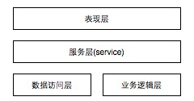

# 移动App架构设计

本文主要总结了几种常用的架构模式, 基本是层层递进的
转载请注名出处 [http://blog.csdn.net/uxyheaven](http://blog.csdn.net/uxyheaven/article/details/38041091), 良好的排版在[https://github.com/uxyheaven/NativeAppFrameworkDesign](https://github.com/uxyheaven/NativeAppFrameworkDesign)阅读

如果觉得本文不错, 请在csdn给个顶, github给个star.

Native app的开发相比传统的项目迭代周期要短很多, 需求的变化也频繁一些, 在开发的不同生命周期里采用不同的架构模式可以有效的节约开发时间, 提高开发效率, 这篇文章介绍几种常用的架构模式:

## 表现层的设计
### 基本的MVC
移动app一般都是采用经典的mvc框架

| 层次 | 作用 | 设计原则 |
| ------------ | ------------- | ------------ |
| 模型层(model) | 封装了应用的一系列数据, 并定义了操作, 处理这些数据的逻辑和计算规则。  |通过Notification,KVO对控制器进行反馈 |
| 视图层(view) | 视图对象是一个应用中, 用户可以看到的对象. 视图对象知道如何绘制自己, 也能够响应用户的操作. 视图对象的主要目的之一是将应用模型对象中的数据显示出来, 并允许用户编辑该数据 | 视图通过不能直接操作模型层, 通过target-action, delegate, dataSource和控制器进行反馈 |
| 控制器层(controller) | 控制器层是在视图层和若干个模型层的中间人  | c可以直接操作模型层和视图层 |

总结:

* C对M：API
* C对V：Outlet
* V对C：Target-action， Delegate，Datasource
* M对C：Notification，KVO

### MVC的改进版 MVVM
MVVM是在MVC的基础上多了一个View Model: 表示逻辑, 将 model 的数据转换为 view 可以呈现的东西. 适合大量展示类的App.

### HMVC
Hierarchical MVC, 把客户端应用程序分解为有层次的父子关系的MVC, 反复应用这个模式, 形成结构化的客户端架构. 适合重型B/S架构的WebApp.

一个MVC模块由应用程序的一个模块抽象而成. 其中很重要的一个概念就是 Parent MVC , 它可以对应界面上的实体, 也可以是一个抽象的对象. 设想一个app 有标签栏, 工具栏, 导航栏, 主工作区, 对应到HMVC上就是这个app最底部的标签栏 是 Layer1, Layer2 导航栏,主要工作区, 工具栏. 如果觉得 Layer2 太复杂可以吧主要工作区放到 Layer3, 依次类推.

Controller 是功能模块的总控室, 它负责和子Controller或父Controller通信，并通知它的 View 处理改变界面显示, Model 处理一些业务逻辑或数据库访问操作. 如才的例子里, 点击了工具栏里的一个按钮, 工具栏的Controller 响应这个event, 发现是要切换主工作区, 工具栏做不了,就传递他的父Controller处理(如果父Controller也处理不了, 就继续往上传递)然后标签栏的Controller处理切换主工作区. 

优点:

* 把程序分成了几个部分, 降低了依赖性 
* 支持鼓励重用代码, 组件或者模块。
* 在今后的维护中, 提高了可扩展性。

## 分层设计
### 三层架构
我们在来看一下经典的三层架构

从上至下为

* 表现层(UI)
* 业务逻辑层或称为领域层(BLL)
* 数据访问层(DAL)

| 层次 | 作用 | 设计原则 |
| ------------ | ------------- | ------------ |
| 表现层(UI) | 向用户展现特定业务数据，采集用户的输入信息和操作  | 用户至上，兼顾简洁；不包含任何业务相关的逻辑处理 |
| 业务逻辑层(BLL) | 从ＤＡＬ中获取数据, 在ＵＩ显示; 从ＵＩ中获取用户指令和数据, 执行业务逻辑或通过ＤＡＬ写入数据源  | 作为U层与Ｄ层的桥梁,目的在于展现清晰的函数结构, 只负责数据处理传递, 不涉及ＳＱＬ语句和ＡＤＯ.ＮＥＴ |
| 数据访问层(DAL) | 直接操作数据库，针对数据的增添 删除 修改 查找; 具体为业务逻辑层或表示层提供数据服务。  | 专门操作数据库, 不考虑数据合法性. 数据库错误返回－1, 逻辑错误返回0, 并告知错误原因, 成功返回1 |

然后呢,我们现在的架构则是

### 四层架构

在三层架构的基础上多了业务规则层, 通常的三层是把业务逻辑和业务规则合并为一个层，统称为业务层. 业务规则层的提出,既可以及时处理用户输入的不合法信息, 又可以及时处理数据库错误, 增大了业务逻辑层的结构清晰度, 让业务逻辑人员专心致志做逻辑.

从上至下为

* 表现层
* 业务规则层
* 业务逻辑层或称为领域层
* 数据访问层

| 层次 | 作用 | 设计原则 |
| ------------ | ------------- | ------------ |
| 业务规则层(ECL) | 对于UI层传下来的参数来说，检查合法性。  | 用户至上，兼顾简洁；不包含任何业务相关的逻辑处理 |

### Service层
service层的架构和普通的分层架构的不同是: service层内部有数据, 可以单独运行.

从上至下为

* 表现层
* 服务层(service)
* 数据访问层
* 业务逻辑层

| 层次 | 作用 | 设计原则 |
| ------------ | ------------- | ------------ |
| 表现层 | 显示与用户的互交  |  |
| 服务层 | service层提供表现层的业务逻辑入口,通过定义接口服务的形式,通过接口调用来完成.  |  |
| 业务逻辑层 | 1接收服务层传来的DTO, 然后根据业务规则, 对传入的DTO进行加工, 返回加工后的信息 2 需要为每个对象提供业务行为, 并且这些对象之间是独立的  3 业务对象之间的交互流程通过服务层来组织  |  |
| 数据访问层 | 本地数据远程数据的访问接口  |  |

## 其他架构
### VIPER
viper这里不多说了,请想了解的自行搜索

## 平台
todo

